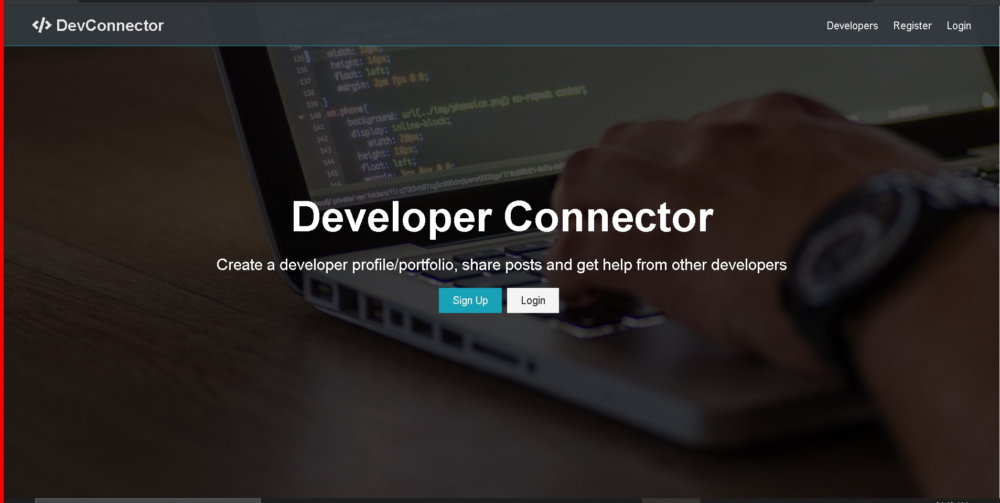
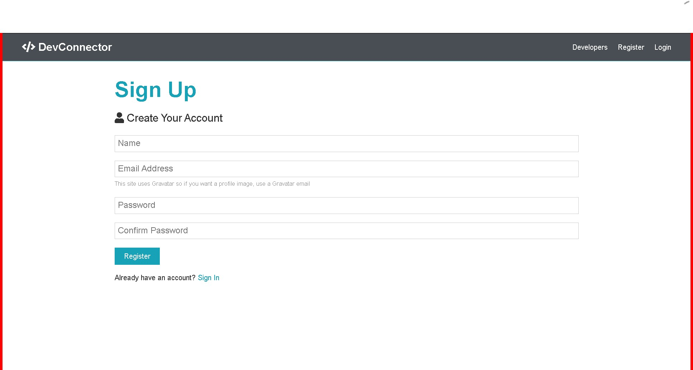
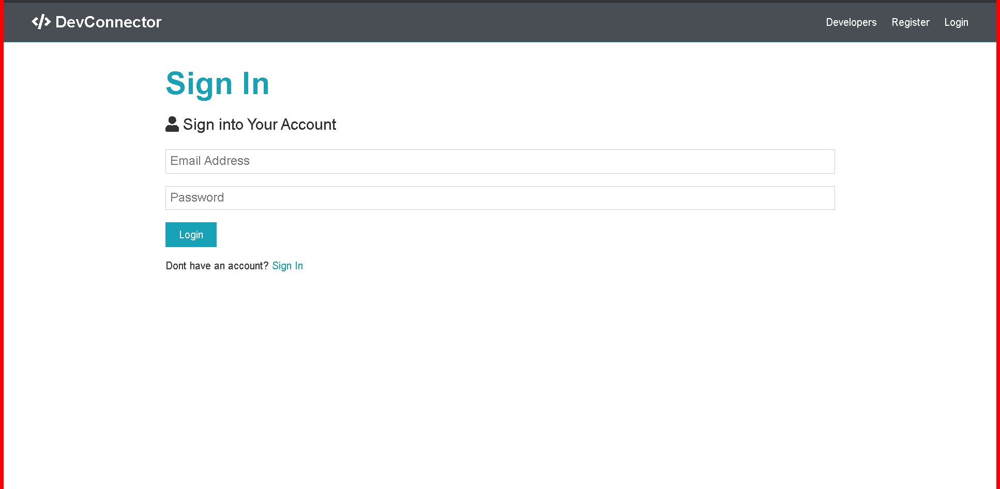
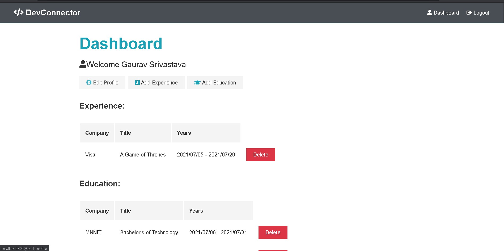

A simple react web application to connect developers

<h1>Connector 1.0</h1>

<h2>Features:</h2>

<h3>User Login/Register</h3>

<h3>Dashboard:</h3>
   Add/Edit/Delete Experience
   Add/Edit/Delete Education

<h3>Display Profile</h3> 

<h3>Post Articles</h3>
<h3>Comment/Likes other posts</h3>

<i>Some sample image of Connector 1.0</i>

